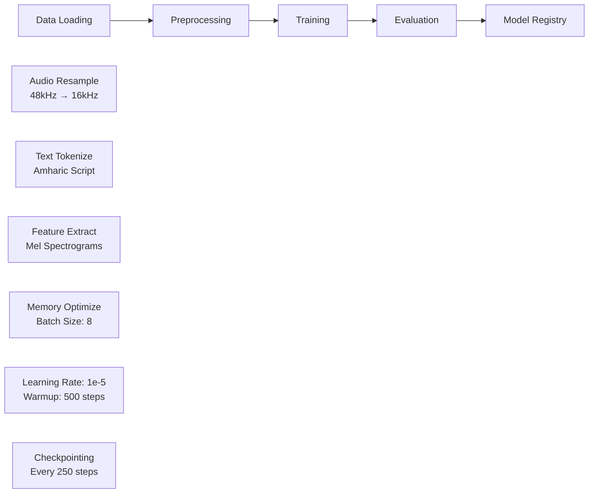

# Whisper Fine-tuning for Amharic Speech Recognition
Fine-tuning OpenAI Whisper for Amharic speech recognition using production-ready MLOps practices.

[](https://huggingface.co/spaces/chappM/whisper-amharic-transcriber)
[](https://huggingface.co/chappM/whisper-amharic-small-v2)

## 🎯 **Overview**

This project addresses the critical gap in **Amharic speech recognition** by fine-tuning OpenAI's Whisper model (small) on Mozilla's Common Voice dataset. Amharic, spoken by 25+ million people in Ethiopia, has limited ASR resources, making this work impactful for language accessibility.

### **Key Insights from Results**
While Whisper-small is a powerful multilingual model, our experiments revealed significant challenges with Amharic out-of-the-box:
- **Baseline struggles**: The pretrained model often failed to recognize Amharic speech, producing nonsensical outputs (e.g., "2.5." for complex sentences) and achieving a WER of 231.58%.
- **Fine-tuning breakthrough**: After fine-tuning on just 698 Amharic samples, transcriptions became remarkably better, reducing WER to 69.64% - a **69.9% relative improvement**.
- **Quality over perfection**: Even with room for optimization, the fine-tuned model produces coherent, contextually relevant transcriptions that closely match ground truth, demonstrating the potential for low-resource language ASR through targeted fine-tuning.

This work shows that while multilingual models provide a strong foundation, domain-specific fine-tuning is essential for underrepresented languages like Amharic.

### **🤗 Try the Model**
**[→ Interactive Demo on Hugging Face Spaces](https://huggingface.co/spaces/chappM/whisper-amharic-transcriber)**

Test the fine-tuned model with your own Amharic audio files or try our sample recordings.


## 🛠️ **Technology Stack**

| Component | Technology | Rationale |
|-----------|------------|-----------|
| **Base Model** | OpenAI Whisper-Small | Proven multilingual ASR performance |
| **Framework** | PyTorch + Transformers | Industry standard for fine-tuning |
| **Orchestration** | ZenML | Reproducible ML pipelines |
| **Experiment Tracking** | MLflow | Comprehensive metrics logging |
| **Dataset** | Common Voice Amharic | High-quality crowdsourced data |
| **Infrastructure** | CUDA + Mixed Precision (RTX 4060) | Memory-efficient training |

## 🔄 **Fine-tuning Pipeline**



## 📊 **Results**

### **Performance Improvement**

| Model | Word Error Rate (WER) | Improvement |
|-------|----------------------|-------------|
| **Baseline (Pretrained)** | 231.58% | - |
| **Fine-tuned** | 69.64% | ↓69.9% |

### **Sample Transcriptions**

| Audio Sample | Ground Truth | Baseline | Fine-tuned |
|--------------|-------------|----------|------------|
| **Sample 1** | ኑሮው ቀን በቀን ይፋጃል። | Nouraouk and Bekanifajal| ኖራው ቀን በቃኔፋው ይፋጨን። ✅ |
| **Sample 2** | አንዳንዶች ፊልምና ዶክመንታሪ ይሰራሉ። | and then don't fillmen a documentary is harallu. | አንዳንዶች ፊልም እና ደውክመን ተሪ ይሰራሉ። ✅ |

While the Whisper-small pretrained model struggled to even detect Amharic—often producing transcriptions in the wrong language or nonsensical outputs—our fine-tuned model shows a dramatic improvement. After fine-tuning, the predictions are much closer to the ground truth. Although not perfect, they are contextually accurate and demonstrate that the model is learning the language. This progress highlights both the effectiveness of fine-tuning for low-resource languages and the potential for further improvement as we continue to refine our approach.

## 🚀 **Quick Start**

### **Setup Environment**
```bash
# Create and activate environment
conda create -n whisper python=3.12
conda activate whisper

# Install dependencies
pip install -r requirements.txt
```

### **Configure Authentication**
```bash
# Login to Hugging Face (required for dataset access)
huggingface-cli login
# Enter your HF token when prompted
```

### **Run Training**
```bash
# Execute complete pipeline
python run_training_pipeline.py
```
## 📁 **Project Structure**

```
├── config/              # Training configuration
├── pipelines/           # ZenML orchestration
├── steps/               # Pipeline components
├── src/                 # Core implementation
├── analysis/            # Data exploration
├── notebooks/           # Baseline evaluation
└── run_training_pipeline.py
```

## 🔮 **Future Work**

I'm actively working on further improving the model's performance:
- **Target WER < 40%**: Optimizing hyperparameters, data augmentation, and training strategies
- **Custom Dataset Testing**: Evaluating on diverse Amharic datasets beyond Common Voice

## 📚 **References**

1. [Fine-Tune Whisper For Multilingual ASR with 🤗 Transformers](https://huggingface.co/blog/fine-tune-whisper)
2. [Mozilla Common Voice Dataset](https://commonvoice.mozilla.org/en/datasets)
---

<div align="center">

</div>